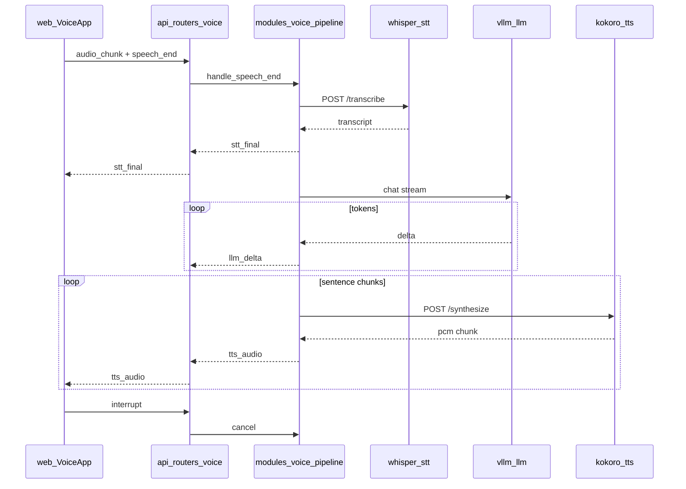

# Neomyth Voice — Architecture

AI Voice Lite module: full-duplex WebSocket voice assistant with STT → LLM → TTS pipeline and smart interruption.

## Data flow

## Latency budget

Target end-to-end: **&lt;1.2s** from `speech_end` to first `tts_audio`.

| Stage | Target | Component |
|-------|--------|-----------|
| STT | 200–400 ms | `deploy/whisper-stt` (faster-whisper-tiny) |
| LLM first token | 150–300 ms | `deploy/vllm-llm` (Qwen3.5-0.8B) |
| TTS first chunk | 200–400 ms | `deploy/kokoro-tts` (sentence chunking) |
| HTTP hops | 15–45 ms | Docker internal network |
| VAD + WebSocket | 100–200 ms | `web/src/components/VoiceApp.tsx` |

## Layer responsibilities

| Path | Responsibility |
|------|----------------|
| `web/src/pages/voice/` | Neo-Voice UI shell (SEO) |
| `web/src/components/VoiceApp.tsx` | Mic, VAD, WebSocket client (hydrated) |
| `api/routers/voice.py` | WebSocket I/O, health, debug |
| `modules/voice/pipeline.py` | Orchestration, cancellation, chunking |
| `modules/voice/graph.py` | LangGraph turn pipeline, session memory (MemorySaver) |
| `modules/voice/clients/` | HTTP/OpenAI clients to workers |
| `modules/shared/` | Audio/text utils, tunable constants |
| `deploy/whisper-stt/` | Faster-Whisper inference |
| `deploy/kokoro-tts/` | Kokoro-82M inference |
| `deploy/vllm-llm/` | Qwen via vLLM |

## Interruption handling

1. **Client**: energy-based VAD detects speech during `speaking` phase → sends `interrupt`, clears playback queue.
2. **Server**: `VoicePipeline.cancel()` increments `generation_id`, ignores in-flight STT/LLM/TTS results.
3. **State**: returns to `listening`.

## Benchmarking latency

1. Open `http://localhost:4321/voice`
2. Start session and speak a short phrase
3. UI shows **Latency** badge: time from `speech_end` to first `tts_audio`

For repeatable tests, use consistent phrase length and ensure workers are warm (first request is slower due to model load).

## WebSocket protocol

**Client → Server**

| Type | Payload |
|------|---------|
| `audio_chunk` | `{ "audio": "<base64 pcm int16>" }` |
| `speech_start` | `{}` |
| `speech_end` | `{}` |
| `interrupt` | `{}` |
| `ping` | `{}` |

**Server → Client**

| Type | Payload |
|------|---------|
| `stt_final` | `{ "text": "..." }` |
| `llm_delta` | `{ "text": "..." }` |
| `tts_audio` | `{ "audio": "<base64>", "sample_rate": 16000 }` |
| `config` | `{ "interrupt_enabled": true|false }` |
| `state` | `{ "phase": "listening|thinking|speaking" }` |
| `error` | `{ "message": "..." }` |

Audio format: **16 kHz, mono, int16 PCM**.

## GPU / VRAM notes

| Worker | VRAM | Fallback |
|--------|------|----------|
| vllm-llm | ~2–4 GB (0.8B) | reduce `--gpu-memory-utilization` |
| whisper-stt | ~1 GB (tiny) | use CPU (`WHISPER_DEVICE=cpu`) |
| kokoro-tts | minimal | run on CPU |

If OOM: run Kokoro on CPU, keep Whisper tiny, limit vLLM GPU memory.
